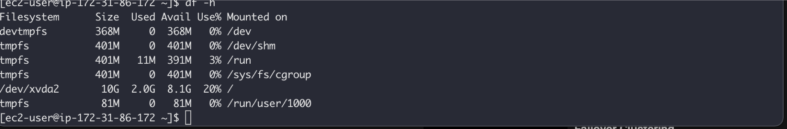
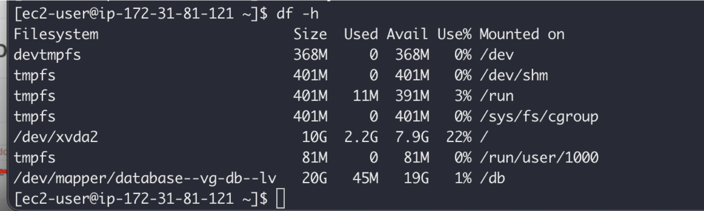

## WEB SOLUTION WITH WORDPRESS

You are progressing in practicing to implement web solutions using different technologies. As a DevOps engineer you will most probably encounter [PHP](https://www.php.net)-based solutions since, even in 2021, it is the dominant web programming language used by more websites than any other programming language.

In this project you will be tasked to prepare storage infrastructure on two Linux servers and implement a basic web solution using [WordPress](https://en.wikipedia.org/wiki/WordPress). WordPress is a free and open-source content management system written in **PHP** and paired with **MySQL** or **MariaDB** as its backend Relational Database Management System (RDBMS).

Project 6 consists of two parts:

1. Configure storage subsystem for Web and Database servers based on Linux OS. The focus of this part is to give you practical experience of working with disks, partitions and volumes in Linux.

2. Install WordPress and connect it to a remote MySQL database server. This part of the project will solidify your skills of deploying Web and DB tiers of Web solution.
As a DevOps engineer, your deep understanding of core components of web solutions and ability to troubleshoot them will play essential role in your further progress and development.

### Three-tier Architecture

Generally, web, or mobile solutions are implemented based on what is called the **Three-tier Architecture**.

**Three-tier Architecture** is a client-server software architecture pattern that comprise of 3 separate layers.


1. **Presentation Layer** (PL): This is the user interface such as the client server or browser on your laptop.
2. **Business Layer** (BL): This is the backend program that implements business logic. Application or Webserver
3. **Data Access or Management Layer** (DAL): This is the layer for computer data storage and data access. [Database Server](https://www.computerhope.com/jargon/d/database-server.htm) or File System Server such as [FTP server](https://titanftp.com/2022/07/05/what-is-an-ftp-server/), or [NFS Server](https://www.techtarget.com/searchenterprisedesktop/definition/Network-File-System)

In this project, you will have the hands-on experience that showcases Three-tier Architecture while also ensuring that the disks used to store files on the Linux servers are adequately partitioned and managed through programs such as <mark>gdisk</mark> and <mark>LVM</mark> respectively.

You will be working working with several storage and disk management concepts, to have a better understanding, watch following video:
[Disk management in Linux](https://www.darey.io/courses/step-12-logical-volume-management/lessons/lesson-1-storage-management/topic/create-linux-partitions-with-fdisk/)

**Note:** We are gradually introducing new AWS elements into our solutions, but do not be worried if you do not fully understand AWS Cloud Services yet, there are Cloud focused projects ahead where we will get into deep details of various Cloud concepts and technologies – not only AWS, but other Cloud Service Providers as well.

Your 3-Tier Setup

1. A Laptop or PC to serve as a client
2. An EC2 Linux Server as a web server (This is where you will install WordPress)
3. An EC2 Linux server as a database (DB) server

Use <mark>RedHat</mark> OS for this project

By now you should know how to spin up an EC2 instance on AWS, but if you forgot – refer to Project1 Step 0.
In previous projects we used ‘Ubuntu’, but it is better to be well-versed with various Linux distributions, thus, for this projects we will use very popular distribution called [‘RedHat’](https://www.redhat.com/en) (it also has a fully compatible derivative – [CentOS](https://www.centos.org))

Note: for Ubuntu server, when connecting to it via SSH/Putty or any other tool, we used <mark>ubuntu</mark> user, but for RedHat you will need to use <mark>ec2-user</mark> user. Connection string will look like <mark>ec2-user@<Public-IP></mark>


## LAUNCH AN EC2 INSTANCE THAT WILL SERVE AS “WEB SERVER”

### Step 1 — Prepare a Web Server

1. Launch an EC2 instance that will serve as "Web Server". Create 3 volumes in the same AZ as your Web Server EC2, each of 10 GiB.
Learn How to Add EBS Volume to an EC2 instance [here](https://www.youtube.com/watch?v=HPXnXkBzIHw)


2. Attach all three volumes one by one to your Web Server EC2 instance


Open up the Linux terminal to begin configuration

3. Use [lsblk](https://man7.org/linux/man-pages/man8/lsblk.8.html) command to inspect what block devices are attached to the server. Notice names of your newly created devices. All devices in Linux reside in /dev/ directory. Inspect it with <mark>ls /dev/</mark> and make sure you see all 3 newly created block devices there – their names will likely be <mark>xvdf, xvdh, xvdg</mark>.


4. Use [df -h](https://en.wikipedia.org/wiki/Df_(Unix)) command to see all mounts and free space on your server




5. Use <mark>gdisk</mark> utility to create a single partition on each of the 3 disks
<mark>sudo gdisk /dev/xvdf</mark>


Use <mark>lsblk</mark> utility to view the newly configured partition on each of the 3 disks.


6. Install [lvm2](https://en.wikipedia.org/wiki/Logical_Volume_Manager_(Linux)) package using <mark>sudo yum install lvm2</mark>. Run <mark>sudo lvmdiskscan</mark> command to check for available partitions.

**Note:** Previously, in Ubuntu we used <mark>apt</mark> command to install packages, in RedHat/CentOS a different package manager is used, so we shall use <mark>yum</marl> command instead.


7. Use [pvcreate](https://linux.die.net/man/8/pvcreate) utility to mark each of 3 disks as physical volumes (PVs) to be used by LVM

```
sudo pvcreate /dev/xvdf1
sudo pvcreate /dev/xvdg1
sudo pvcreate /dev/xvdh1
```


8. Verify that your Physical volume has been created successfully by running <mark>sudo pvs</mark>


9. Use [vgcreate](https://linux.die.net/man/8/vgcreate) utility to add all 3 PVs to a volume group (VG). Name the VG **webdata-vg**

`sudo vgcreate webdata-vg /dev/xvdh1 /dev/xvdg1 /dev/xvdf1`


10. Verify that your VG has been created successfully by running <mark>sudo vgs</mark>


11. Use [lvcreate]() utility to create 2 logical volumes. **apps-lv (Use half of the PV size)**, and **logs-lv Use the remaining space of the PV size. NOTE:** apps-lv will be used to store data for the Website while, logs-lv will be used to store data for logs.

```
sudo lvcreate -n apps-lv -L 14G webdata-vg
sudo lvcreate -n logs-lv -L 14G webdata-vg
```


12. Verify that your Logical Volume has been created successfully by running <mark>sudo lvs</mark>


13. Verify the entire setup

```
sudo vgdisplay -v #view complete setup - VG, PV, and LV
sudo lsblk 
```


14. Use <mark>mkfs.ext4</mark> to format the logical volumes with [ext4](https://en.wikipedia.org/wiki/Ext4) filesystem

```
sudo mkfs -t ext4 /dev/webdata-vg/apps-lv 
sudo mkfs -t ext4 /dev/webdata-vg/logs-lv
```


15. Create **/var/www/html** directory to store website files

<mark>sudo mkdir -p /var/www/html</mark>


16. Create **/home/recovery/logs** to store backup of log data

<mark>sudo mkdir -p /home/recovery/logs</mark>


17. Mount **/var/www/html** on **apps-lv** logical volume

`sudo mount /dev/webdata-vg/apps-lv /var/www/html/`


18. Use [rsync](https://linux.die.net/man/1/rsync) utility to backup all the files in the log directory **/var/log** into **/home/recovery/logs** (This is required before mounting the file system)
   
`sudo rsync -av /var/log/. /home/recovery/logs/`


19. Mount **/var/log** on **logs-lv** logical volume. (Note that all the existing data on /var/log will be deleted. That is why step 15 above is very
    important)

`sudo mount /dev/webdata-vg/logs-lv /var/log`


20. Restore log files back into /var/log directory

`sudo rsync -av /home/recovery/logs/. /var/log`


21. Update <mark>/etc/fstab file</mark> so that the mount configuration will persist after restart of the server.

**Click on the next button** To update the <mark>/etc/fstab file</mark>


## UPDATE THE `/ETC/FSTAB` FILE

1. The UUID of the device will be used to update the <mark>/etc/fstab</mark> file;

`sudo blkid`

`sudo nano /etc/fstab`

Update <mark>/etc/fstab</mark> in this format using your own UUID and rememeber to remove the leading and ending quotes.


Test the configuration and reload the daemon
```
sudo mount -a
sudo systemctl daemon-reload
```


Verify your setup by running df -h, output must look like this


### Step 2 — Prepare the Database Server

Launch a second RedHat EC2 instance that will have a role – ‘DB Server’
Repeat the same steps as for the Web Server, but instead of <mark>apps-lv</mark> create <mark>db-lv</mark> and mount it to <mark>/db</mark> directory instead of <mark>/var/www/html/</mark>.



### Step 3 — Install WordPress on your Web Server EC2

1. Update the repository

`sudo yum -y update`


2. Install wget, Apache and it’s dependencies

`sudo yum -y install wget httpd php php-mysqlnd php-fpm php-json`


3. Start Apache

```
sudo systemctl enable httpd
sudo systemctl start httpd
```


4. To install PHP and it’s depemdencies

```
sudo yum install https://dl.fedoraproject.org/pub/epel/epel-release-latest-8.noarch.rpm
sudo yum install yum-utils http://rpms.remirepo.net/enterprise/remi-release-8.rpm
sudo yum module list php
sudo yum module reset php
sudo yum module enable php:remi-7.4
sudo yum install php php-opcache php-gd php-curl php-mysqlnd
sudo systemctl start php-fpm
sudo systemctl enable php-fpm
setsebool -P httpd_execmem 1
```


5. Restart Apache

`sudo systemctl restart httpd`

6. Download wordpress and copy wordpress to var/www/html

```
mkdir wordpress
cd   wordpress
sudo wget http://wordpress.org/latest.tar.gz
sudo tar xzvf latest.tar.gz
sudo rm -rf latest.tar.gz
cp wordpress/wp-config-sample.php wordpress/wp-config.php
cp -R wordpress /var/www/html/
```


7. Configure SELinux Policies

```
sudo chown -R apache:apache /var/www/html/wordpress
sudo chcon -t httpd_sys_rw_content_t /var/www/html/wordpress -R
sudo setsebool -P httpd_can_network_connect=1
```


### Step 4 — Install MySQL on your DB Server EC2

```
sudo yum update
sudo yum install mysql-server
```


Verify that the service is up and running by using sudo systemctl status mysqld, if it is not running, restart the service and enable it so it will be running even after reboot:

```
sudo systemctl restart mysqld
sudo systemctl enable mysqld
```


### Step 5 — Configure DB to work with WordPress

```
sudo mysql
CREATE DATABASE wordpress;
CREATE USER `myuser`@`<Web-Server-Private-IP-Address>` IDENTIFIED BY 'mypass';
GRANT ALL ON wordpress.* TO 'myuser'@'<Web-Server-Private-IP-Address>';
FLUSH PRIVILEGES;
SHOW DATABASES;
exit
````


### Step 6 — Configure WordPress to connect to remote database.
Hint: Do not forget to open MySQL port 3306 on DB Server EC2. For extra security, you shall allow access to the DB server ONLY from your Web Server’s IP address, so in the Inbound Rule configuration specify source as /32


1. Install MySQL client and test that you can connect from your Web Server to your DB server by using <mark>mysql-client</mark>
``
sudo yum install mysql
sudo mysql -u admin -p -h <DB-Server-Private-IP-address>
``


2. Verify if you can successfully execute <mark>SHOW DATABASES;</mark> command and see a list of existing databases.
3. Change permissions and configuration so Apache could use WordPress:
4. Enable TCP port 80 in Inbound Rules configuration for your Web Server EC2 (enable from everywhere 0.0.0.0/0 or from your workstation’s IP)
5. Try to access from your browser the link to your WordPress <mark>http://<Web-Server-Public-IP-Address>/wordpress/</mark>


Fill out your DB credentials:


If you see this message – it means your WordPress has successfully connected to your remote MySQL database


**Important:** Do not forget to **STOP** your EC2 instances after completion of the project to avoid extra costs.


CONGRATULATIONS!
You have learned how to configure Linux storage subsystem and have also deployed a full-scale Web Solution using WordPress CMS and MySQL RDBMS!

